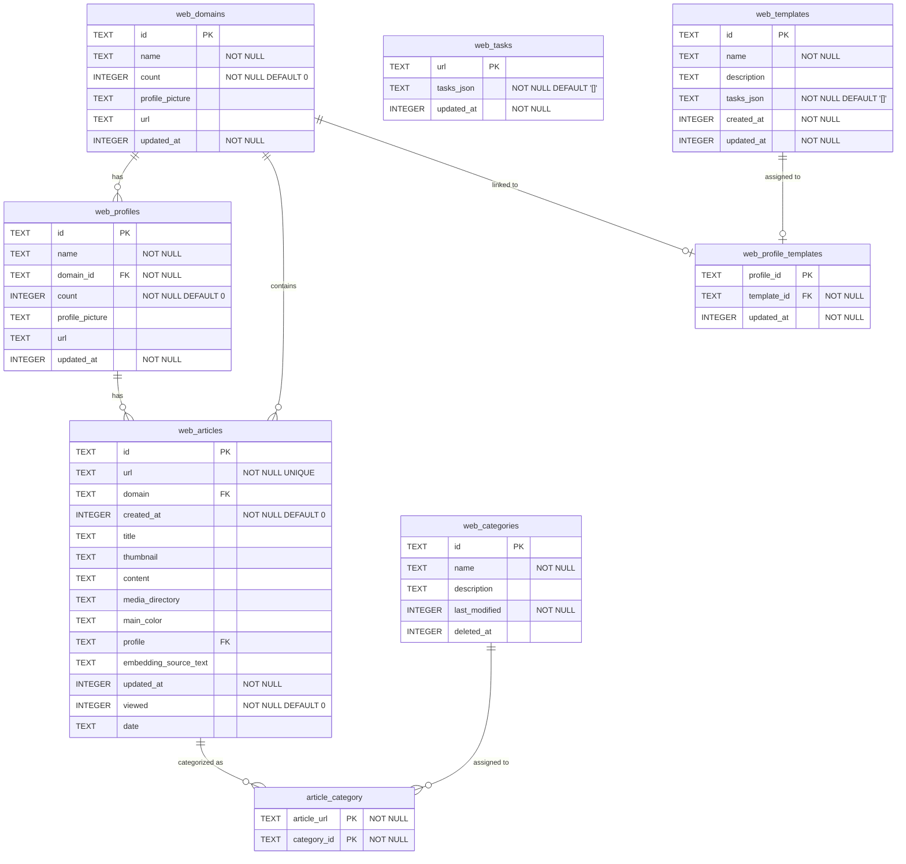

# Database ER Diagram

Source: `src-tauri/src/web_store.rs`

## Relationships Summary

| From | To | Type | FK |
|---|---|---|---|
| web_domains | web_profiles | 1:N | `web_profiles.domain_id` -> `web_domains.id` |
| web_domains | web_articles | 1:N | `web_articles.domain` -> `web_domains.id` |
| web_profiles | web_articles | 1:N | `web_articles.profile` matches `web_profiles.id` (soft) |
| web_categories | article_category | 1:N | `article_category.category_id` -> `web_categories.id` |
| web_articles | article_category | 1:N | `article_category.article_url` -> `web_articles.url` |
| web_templates | web_profile_templates | 1:1 | `web_profile_templates.template_id` -> `web_templates.id` |
| web_domains | web_profile_templates | 1:1 | `web_profile_templates.profile_id` -> `web_domains.id` |
| web_tasks | web_articles | 1:1 | `web_tasks.url` <-> `web_articles.url` (soft) |

> **Notes:**
> - `web_articles.profile` is a soft foreign key (string match, no FK constraint).
> - `web_tasks.url` links to `web_articles.url` by convention, not enforced by a formal FK.
> - `article_category.article_url` references `web_articles.url` by convention (no formal FK constraint).
