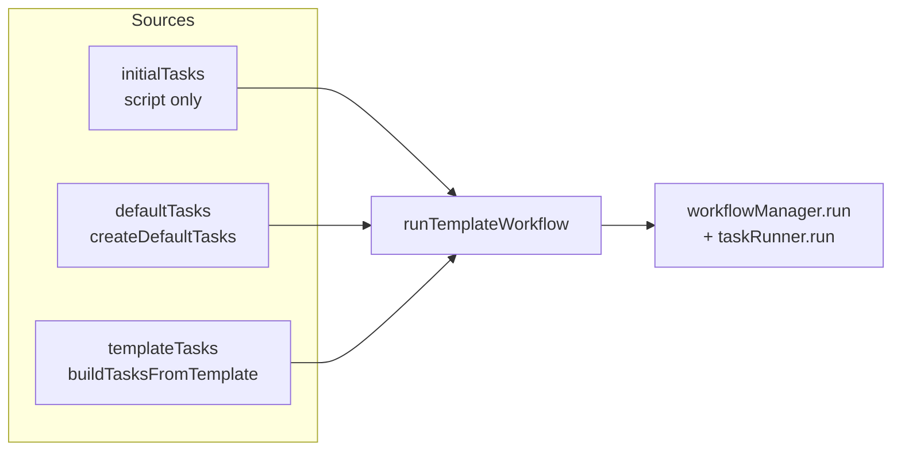
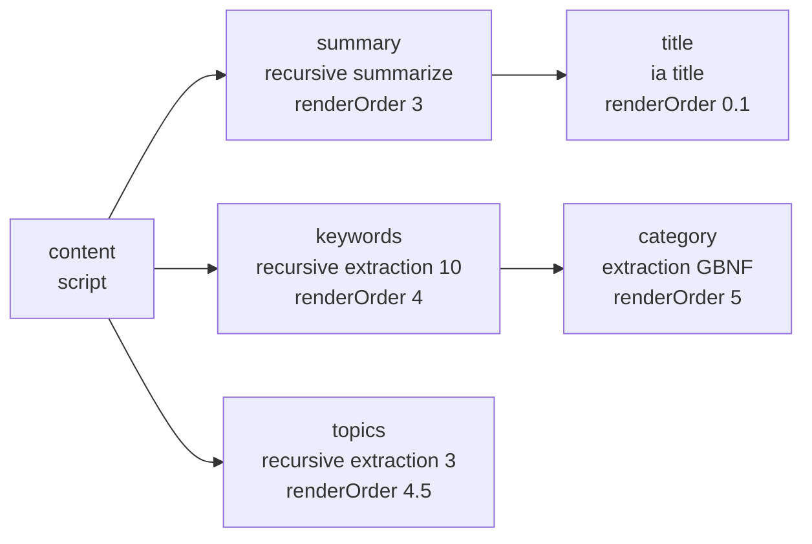
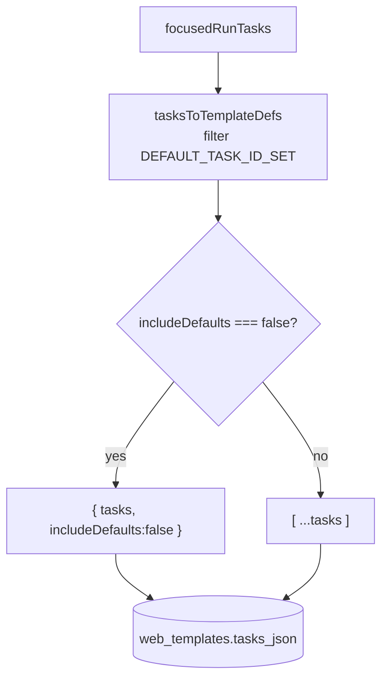
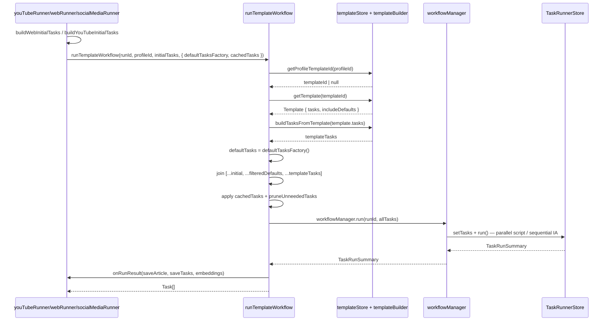

# Template-Runner Assembly — How Final Tasks Are Built

Source of truth: `src/runners/templateRunner.ts:81`, `src/runners/shared/sharedTasks.ts:75`, `src/stores/templateStore.ts:11`, `src/runners/templateBuilder.ts:19`, `src/components/TemplateManager.svelte:37`.

The Task Runner itself (`src/runners/taskRunner.svelte.ts`, `DOCS/RunnerDoc.md`) is a DAG scheduler — it just runs the `Task[]` it receives. This document explains the **assembly layer** that builds that final `Task[]` from three independent sources before handing it to the runner.

---

## 1. Three Sources

| Source          | Where it comes from                                                                                                                                 | What it contains                                                                                | Persisted?                        |
| --------------- | --------------------------------------------------------------------------------------------------------------------------------------------------- | ----------------------------------------------------------------------------------------------- | --------------------------------- |
| `initialTasks`  | Per-domain runner (`src/runners/youtube/youTubeRunner.ts:38`, `src/runners/web/webRunner.ts:28`, `src/runners/socialMedia/socialMediaRunner.ts:35`) | `init-*`, `profile`, `thumbnail`, `content`, `transcribe`, etc. – always `type: 'script'`       | No – re-created per run           |
| `defaultTasks`  | `src/runners/shared/sharedTasks.ts:83` `createDefaultTasks('content')`                                                                              | 5 IA/recursive tasks: `summary`, `keywords`, `topics`, `category`, `title` (`DEFAULT_TASK_IDS`) | **No** – injected at runtime      |
| `templateTasks` | `src/stores/templateStore.ts:11` + `src/runners/templateBuilder.ts:19` `buildTasksFromTemplate()`                                                   | User-authored IA/extractor/recursive tasks stored in `web_templates.tasks_json`                 | Yes – via `tasksToTemplateDefs()` |



Key rule: **defaults are never saved** — they are joined at runtime. `src/stores/templateStore.ts:136` filters them:

```ts
if (DEFAULT_TASK_ID_SET.has(task.id)) return [];
```

So a template created from the current run (`src/components/TemplateManager.svelte:88`) stores only custom tasks.

---

## 2. Assembly Flow — `runTemplateWorkflow`

**File:** `src/runners/templateRunner.ts:81`

```mermaid
flowchart TD
    Start([runTemplateWorkflow<br/>runId, profileId, initialTasks, options]) --> GTP[getProfileTemplateId<br/>src/stores/templateStore.ts:98]
    GTP --> GT{templateId?}
    GT -->|yes| LOAD[getTemplate<br/>src/stores/templateStore.ts:60]
    GT -->|no| NO_TPL[template = null]
    LOAD --> RESOLVE

    RESOLVE[Resolve Tasks] --> DEF[defaultTasks = defaultTasksFactory?.() ?? []<br/>youtube/web/social]
    DEF --> TPL[templateTasks = template ? buildTasksFromTemplate<br/>src/runners/templateBuilder.ts:95 : []]
    TPL --> INC{template?.includeDefaults !== false?}

    INC -->|false| ONLY["allTasks = [...initialTasks, ...templateTasks]"]
    INC -->|true| DEDUP["templateIds = Set(templateTasks.map t.id)<br/>filteredDefaults = defaultTasks.filter t.id not in templateIds<br/>allTasks = [...initialTasks, ...filteredDefaults, ...templateTasks]"]

    ONLY --> SKIP
    DEDUP --> SKIP

    SKIP{skipTaskIds?}
    SKIP -->|yes| CLOSURE["closure = skip + descendants via DependencyGraph<br/>filter allTasks"]
    SKIP -->|no| CACHE

    CLOSURE --> CACHE

    CACHE{Rebuild?}
    CACHE -->|no| APPLY["applyPersistedTaskState + pruneUnneededTasks<br/>src/runners/taskBuilder.ts + pruneUnneededTasks"]
    CACHE -->|yes| RUN
    APPLY --> RUN

    RUN[workflowManager.run<br/>src/runners/workflowManager.svelte.ts]
    RUN --> CB{onRunResult?}
    CB -->|yes| SAVE[saveArticle/saveTasks + embeddings]
    CB -->|no| RET
    SAVE --> RET([return runResult.tasks])
```

### Step details

1. **Resolve profile template** (`src/runners/templateRunner.ts:87`)  
   `getProfileTemplateId(profileId)` reads `web_profile_templates`. If none, `template = null`.

2. **Materialize sources** (`src/runners/templateRunner.ts:90-92`)

   ```ts
   const defaultTasks = options.defaultTasksFactory?.() ?? []; // 5 tasks or []
   const templateTasks = template ? buildTasksFromTemplate(template.tasks) : [];
   const includeDefaults = template?.includeDefaults !== false; // true by default
   ```

3. **Join with dedupe, template wins** (`src/runners/templateRunner.ts:94-101`)  
   Order is always `[...initial, ...defaults, ...template]`. If template defines `summary`, the default `summary` is dropped. Handles old templates that still contain defaults.

4. **Optional skip closure** (`src/runners/templateRunner.ts:103-114`)  
   `skipTaskIds` expands to descendants via `DependencyGraph.getDescendants()`.

5. **Cache / prune** (`src/runners/templateRunner.ts:116-126`)  
   `createPersistedTaskStateMap(cachedTasks)` → `applyPersistedTaskState` marks tasks `done` with `data`; `pruneUnneededTasks` marks satisfied leaves as `done` to avoid re-run.

6. **Execute** (`src/runners/templateRunner.ts:128`)  
   Delegates to `workflowManager.run()` which creates a `TaskRunnerStore` and calls `taskRunner.run()` (DAG parallel script / sequential IA).

---

## 3. Default Tasks — `src/runners/shared/sharedTasks.ts:75`



Exported as:

```ts
export const DEFAULT_TASK_IDS = ['summary','keywords','topics','category','title'] as const;
export const DEFAULT_TASK_ID_SET = new Set(DEFAULT_TASK_IDS);
export function createDefaultTasks(contentDependency='content'): Task[] { ... }
```

All callers use `() => createDefaultTasks('content')` (`src/runners/youtube/youTubeRunner.ts:200`, `src/runners/web/webRunner.ts:157`, `src/runners/socialMedia/socialMediaRunner.ts:92`).

---

## 4. Persistence — Envelope + Filtering

### Saving (`src/stores/templateStore.ts:43,71,136`)

`TemplateManager` builds defs from the current run:

```ts
const templateDefs = tasksToTemplateDefs(workflowStore.focusedRunTasks);
await saveTemplate({ id, name, tasks: templateDefs, includeDefaults });
```

`tasksToTemplateDefs` skips defaults and `script` non-recursive tasks. `serializeTemplateTasks` avoids a DB migration:

```ts
if (includeDefaults === false) return JSON.stringify({ tasks, includeDefaults: false });
return JSON.stringify(tasks); // legacy shape, includeDefaults=true implied
```



### Loading (`src/stores/templateStore.ts:11`)

```ts
const parsed = JSON.parse(record.tasksJson);
if (Array.isArray(parsed)) {
	tasks = parsed;
	includeDefaults = true;
} else if (parsed.tasks) {
	tasks = parsed.tasks;
	includeDefaults = parsed.includeDefaults !== false;
}
```

Old rows (array) keep working; new rows with `includeDefaults=false` opt out of defaults.

### Builder (`src/runners/templateBuilder.ts:19`)

`buildTaskFromTemplateDef` maps `TemplateTaskDef` → `Task` via `buildRecursiveTask` / `buildTask` (category/extraction/ia). Defs are the single source for `component`, `renderOrder`, `completionOptions`, `gridSpan`, etc.

---

## 5. IncludeDefaults Flag — UI

**File:** `src/components/TemplateManager.svelte:37,51,88`

- State `includeDefaults` (`$state(true)`) synced via `$effect` to `selectedTemplateId` → `found.includeDefaults !== false`.
- Shown in **Actions** (update) and **Create form** (`src/components/TemplateManager.svelte:254,282`) as checkbox “Include default tasks (summary, keywords, …)”.
- Values persisted on `handleCreate` / `handleCloneSelected` / `handleUpdate`.

When `false`, `runTemplateWorkflow` skips the join entirely (custom tasks only).

---

## 6. End-to-End Sequence (domain runner → runner)



---

## 7. Where to Change What

| Need                                | Edit                                                                                                                            |
| ----------------------------------- | ------------------------------------------------------------------------------------------------------------------------------- |
| Change default set                  | `src/runners/shared/sharedTasks.ts:75` `DEFAULT_TASK_IDS` + `createDefaultTasks()`                                              |
| Change join order / dedupe          | `src/runners/templateRunner.ts:94`                                                                                              |
| Change what is persistable          | `src/stores/templateStore.ts:136` `tasksToTemplateDefs()`                                                                       |
| Change serialization shape          | `src/stores/templateStore.ts:43` `serializeTemplateTasks` / `parseTemplateRecord`                                               |
| Change per-template opt-out default | `src/runners/templateRunner.ts:92` + `TemplateManager.svelte:51`                                                                |
| Change template → Task mapping      | `src/runners/templateBuilder.ts:19`                                                                                             |
| Per-domain initials                 | `src/runners/youtube/youTubeRunner.ts:38`, `src/runners/web/webRunner.ts:28`, `src/runners/socialMedia/socialMediaRunner.ts:35` |

No Rust migration needed — `web_templates.tasks_json` stays `TEXT`.

---

## 8. Related Docs

- `DOCS/RunnerDoc.md` — DAG scheduler itself.
- `DOCS/YouTubeRunnerFlow.md` — legacy YouTube-specific flow (now delegates to `templateRunner`).
- `DOCS/TaskCreation.md` — factories (`createIaTask`, `buildRecursiveTask`).
- `src/runners/youtube/youtube-route-flow.md` — channel/video-specific steps before the shared assembly.
