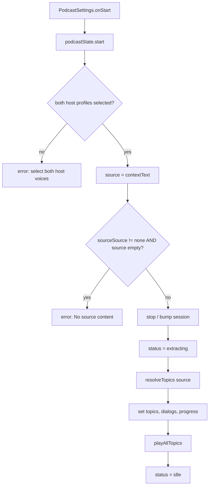
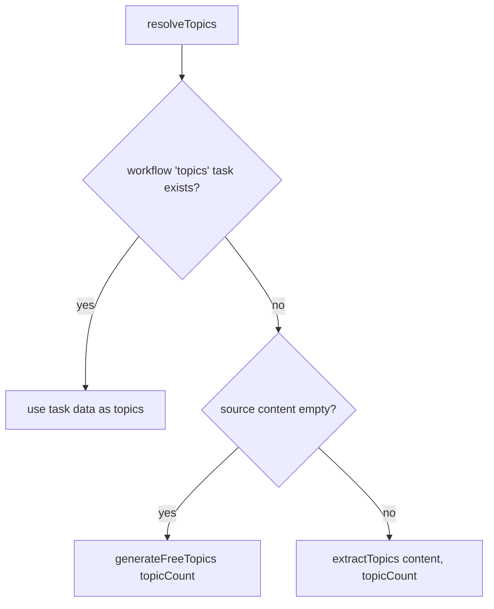
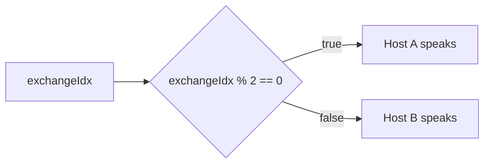
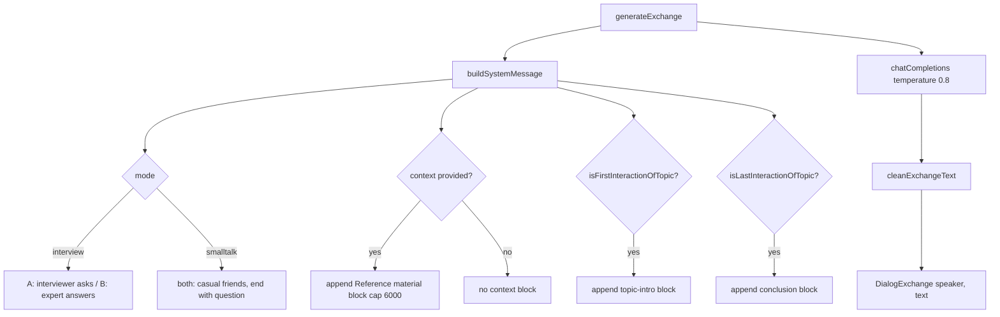
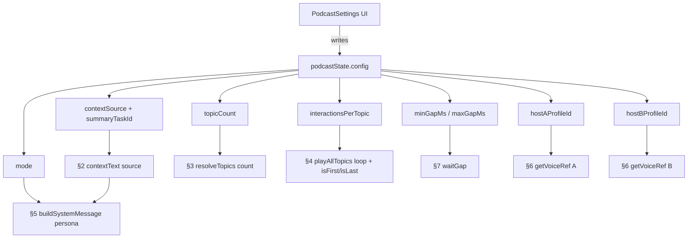

# Podcast Generation Flow

This document traces how a podcast episode is generated in Notian, from the settings panel to final audio playback. It is the counterpart to `DOCS/tts-flow.md`, focused on the orchestration done by `PodcastSettings.svelte` and `podcastStore.svelte.ts`.

## Overview

```
PodcastSettings (user configures → onStart)
  → podcastState.start()
    → validate hosts + context
    → resolveTopics()            (LLM: topic extraction)
    → playAllTopics()            (loop topics × interactions)
        → prepareExchange()      (LLM dialog + TTS audio)
        → playExchange()         (Web Audio playback)
        → waitGap()              (random pause between hosts)
```

Unlike the lazy TTS flow, the podcast pipeline **pre-generates** the dialog text and audio for the current/next exchanges ahead of playback, then plays them in sequence.

---

## 1. Entry Point

**`src/components/PodcastSettings.svelte`** — The user picks every setting described in section 4, then clicks "Start Podcast":

```ts
async function handleStart() {
	loading = true;
	drawersState.close('podcast-settings');
	await podcastState.start();
	loading = false;
	onStart?.();
}
```

`podcastState` (`src/stores/podcastStore.svelte.ts`) is a Svelte 5 runes singleton holding both the `config` (`PodcastConfig`) and all runtime state (`topics`, `dialogs`, `status`, blobs, etc.).

---

## 2. Start Orchestration

**`podcastStore.svelte.ts:209-248`** — `start()`:

1. **Validate voices** — Both `hostAProfileId` and `hostBProfileId` must be set, otherwise `errorMessage = 'Please select both host voices'` and abort.
2. **Resolve context** — `contextText` getter (`podcastStore.svelte.ts:169-188`) builds the source text from `contextSource` + `summaryTaskId`.
3. **Validate context** — If `contextSource !== 'none'` and the resolved source is empty, `errorMessage = 'No source content available…'` and abort.
4. **Reset** — `stop()` bumps `_session` (invalidating any in-flight async work) and clears playback state.
5. **Extract topics** — `resolveTopics()` (see section 3).
6. **Set progress** — `total = topics.length × interactionsPerTopic`.
7. **Play** — `playAllTopics()`.

### Flowchart



---

## 3. Topic Extraction

**`podcastStore.svelte.ts:190-207`** — `resolveTopics()`:



- **Existing workflow task** — If a `topics` task is present in `workflowStore.stackedTasks` or `focusedRunTasks`, its output is normalized and reused directly (no LLM call).
- **No content** — `generateFreeTopics(topicCount)` asks the LLM for `topicCount` creative topics.
- **With content** — `extractTopics(content, topicCount)` (see `topicExtractor.ts`) asks the LLM to pull exactly `topicCount` topics from the source text via a JSON-schema response.

`topicCount` controls how many topics are requested in the latter two paths, and therefore the outer loop size in `playAllTopics`.

---

## 4. Per-Exchange Generation

**`podcastStore.svelte.ts:250-349`** — `playAllTopics()` iterates `topic ∈ [0, topics.length)` and, for each, `exchange ∈ [0, interactionsPerTopic)`. For every exchange it:

1. Sets `status = 'generating'`.
2. Calls `prepareExchange(t, e)` which (if not cached):
   - picks `speaker = exchangeIdx % 2 === 0 ? 'A' : 'B'`,
   - calls `generateExchange()` (LLM dialog line),
   - calls `generateExchangeAudio()` (TTS).
3. Plays the exchange (`playExchange`).
4. Prefetches the next exchange (or next topic's first) so playback is continuous.
5. Calls `waitGap()` before the next exchange (unless it was the very last).

### Speaker alternation



The speaker determines both the **voice** (`getVoiceRef(speaker)`) and the **persona** inside the LLM prompt.

---

## 5. LLM Dialog Generation

**`src/lib/utils/podcast/dialogGenerator.ts`** — `generateExchange()`:



Key modifiers:

- **`mode`** — `interview` casts A as the question-asking interviewer and B as the answering expert; `smalltalk` makes both hosts casual friends who must end each turn with a question/prompt.
- **`context`** — Capped at 6000 chars and appended as "Reference material" to ground responses in the source text.
- **`isFirstInteractionOfTopic`** / **`isLastInteractionOfTopic`** — Derived from `exchangeIdx` and `interactionsPerTopic`; these inject the topic-introduction and topic-conclusion prompt blocks.

`cleanExchangeText()` strips code fences, surrounding quotes, and any `Host A:` / name prefixes the model may emit.

---

## 6. Audio Generation & Playback

**`podcastStore.svelte.ts:408-461`** — `generateExchangeAudio()`:

```
exchange.text
  → splitTextIntoChunks(text, ttsState.config.splitLevel)   // reused from TTS flow
  → for each chunk:
        voiceRef = getVoiceRef(speaker)                     // random chunk from host profile
        generateSpeech({ text, ref_audio, ref_text, ...ttsState.config })  // POST /tts/mp3
        → push Blob
  → combined = new Blob(blobs, { type: 'audio/mpeg' })
```

`playExchange()` decodes the combined blob and plays it through the same Web Audio graph used elsewhere:

```
AudioBufferSourceNode → AnalyserNode → AudioContext.destination
```

`ttsState.config` (split level, inference steps, speed, denoise, etc.) is inherited from the global TTS settings — it is **not** exposed in `PodcastSettings`. See `DOCS/tts-flow.md` for the full TTS breakdown.

---

## 7. Gap Between Hosts

**`podcastStore.svelte.ts:600-613`** — `waitGap()`:

```ts
const min = Math.max(0, Math.min(minGapMs, maxGapMs));
const max = Math.max(minGapMs, maxGapMs);
const delay = min + Math.random() * (max - min);
```

A random silence between `minGapMs` and `maxGapMs` is inserted after every exchange (except the final one), simulating a natural pause between hosts.

---

## 8. Settings → Flow Impact

Every control in `PodcastSettings.svelte` writes directly into `podcastState.config`. The table below maps each UI control to the field it sets and the exact stage of the flow it alters.

| UI control | Config field | Stage affected | Effect on the flow |
| --- | --- | --- | --- |
| **Interview** / **Small Talk** | `mode` | §5 `buildSystemMessage` | Switches host personas (interviewer/expert vs casual friends) and whether each turn must end with a question |
| **Content** / **Summary** / **None** | `contextSource` | §2 `contextText` | Chooses the source text fed into every `generateExchange`: workflow `content` tasks, a chosen `summary` task, or empty |
| **Summary task dropdown** | `summaryTaskId` | §2 `contextText` | Selects which summary task's data becomes context (only used when `contextSource === 'summary'`) |
| **Topics** | `topicCount` | §3 `resolveTopics` | Number of topics requested from the LLM; sets the outer loop size and `progress.total` |
| **Interactions per topic** | `interactionsPerTopic` | §4 `playAllTopics` | Number of exchanges per topic; also sets the `isFirst`/`isLast` flags that trigger intro/conclusion prompt blocks |
| **Min gap** / **Max gap** | `minGapMs` / `maxGapMs` | §7 `waitGap` | Random silence duration inserted between exchanges (between-host pause) |
| **Host A voice grid** | `hostAProfileId` | §4 `getVoiceRef` / §5 names | Voice reference (random chunk) for TTS of Host A's lines and the host name embedded in prompts; required to start |
| **Host B voice grid** | `hostBProfileId` | §4 `getVoiceRef` / §5 names | Same as Host A, for Host B |

### Settings flow at a glance



---

## 9. Cancellation & Lifecycle

- **`stop()`** — Bumps `_session` so all in-flight `prepareExchange`/playback promises bail out via session checks; aborts `_genAbort`/`_llmAbort`/`_playbackAbort`; clears gap timers and blob cache; resets `status` to `idle`.
- **`pause()` / `resume()`** — Pauses the active `AudioBufferSourceNode`; resume replays the current exchange blob from the start.
- **`regenerateExchange(t, e)`** — Deletes the cached blob + promise for one exchange, regenerates its dialog + audio, and replays it.
- **`fullReset()`** — `stop()` plus clearing topics, dialogs, voice chunks, and progress.

The `_session` counter is the central guard: every async step compares its captured `session` against `this._session` and returns early if they differ, making `stop()` an immediate hard reset.
