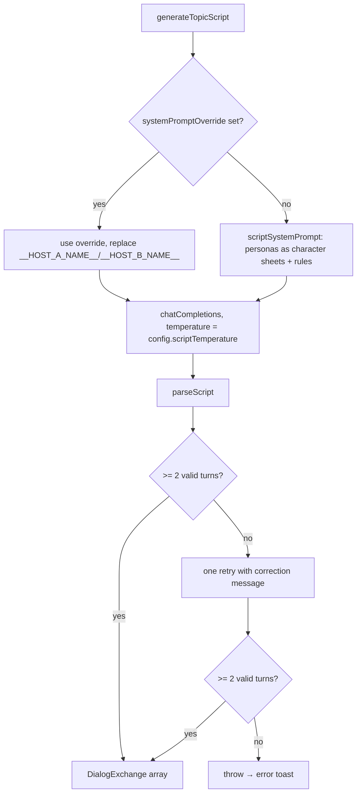

# Podcast Generation Flow

This document traces how a podcast episode is generated, from the settings panel to final audio playback. It is the counterpart to `DOCS/tts-flow.md`, focused on the orchestration done by `PodcastSettings.svelte` and `podcastStore.svelte.ts`.

## Overview

```
PodcastSettings (user configures)
  → podcastState.start()
    → validate hosts + context
    → resolveTopics()              (reads workflow 'analysis' task)
    → playAllTopics()              (loop topics)
        → prepareTopicScript()     (LLM: full dialog script, 1 call per topic)
        → prepareExchangeAudio()   (TTS, prefetch lookahead)
        → playExchange()           (Web Audio playback)
        → waitMs(topicGap/exchangeGap)
```

The podcast pipeline **pre-generates the whole dialog script for a topic in a single LLM call** (`generateTopicScript`), parses it into `DialogExchange[]`, and then only synthesizes audio turn by turn. While a topic plays, the next topic's script (and its first audio) is generated in the background, so the cold-start LLM wait is only perceived on the first topic.

---

## 1. Entry Point

**`src/features/podcast/PodcastSettings.svelte`** — every control writes directly into `podcastState.config` (`PodcastConfig`). Playback starts from `PodcastMode.svelte` (hotkey `P` or the play button) via `podcastState.start()`.

`podcastState` (`src/features/podcast/podcastStore.svelte.ts`) is a Svelte 5 runes singleton holding both the `config` and all runtime state (`topics`, `dialogs`, `status`, blobs, etc.).

---

## 2. Start Orchestration

**`podcastStore.svelte.ts` — `start()`**:

1. **Validate voices** — Both `hostAProfileId` and `hostBProfileId` must be set, otherwise `errorMessage = 'Please select both host voices'` and abort.
2. **Validate context** — If `contextSource !== 'none'` and `contentTaskText` is empty, `errorMessage = 'No source content available…'` and abort.
3. **Reset** — `stop()` bumps `_session` (invalidating any in-flight async work) and clears playback state.
4. **Extract topics** — `resolveTopics()` (see section 3), sliced to `config.topicCount`.
5. **Set progress** — `total = topics.length × interactionsPerTopic + enabled hooks` (an estimate; scripts may yield slightly different turn counts).
6. **Play** — `playAllTopics()`.

---

## 3. Topic Extraction

**`resolveTopics()`** — topics come exclusively from a completed workflow **`analysis`** task (stacked or focused run), normalized by `extractTopicsFromAnalysis()` in `topicExtractor.ts`. No LLM call happens here; if no analysis task exists, `start()` aborts with `No topics found.`

`topicCount` slices the extracted topic list and therefore sets the outer loop size in `playAllTopics`.

---

## 4. Per-Topic Script Generation

**`podcastStore.svelte.ts` — `playAllTopics()`** iterates `topic ∈ [0, topics.length)`. For each topic:

1. If `dialogs[t]` is empty: `status = 'generating'` and `prepareTopicScript(t)` fills it (see section 5).
2. For each exchange `e` in the generated script:
   - `prepareExchangeAudio(t, e)` — TTS only (text already exists). Cached by `${t}:${e}` key in `_preparePromises`/`_blobs`.
   - Prefetch: next exchange's audio; on the last exchange, the **next topic's script + its first audio** (fire-and-forget).
   - `playExchange(t, e)` → `playBlobEntry` through the Web Audio graph.
   - Wait `exchangeGapMs` between turns, `topicGapMs` between topics.

### Script generation

**`scriptGenerator.ts` — `generateTopicScript()`**:



Key inputs (all from `podcastState.config`):

- **`interactionsPerTopic`** — requested number of turns in the script.
- **`turnLengthSentences`** — target length of each turn ("about N sentences").
- **`speakerDynamics`** — `alternate` forces strict A/B/A/B starting with A; `free` lets the LLM assign turns. The parser accepts either way; the flag is an instruction, not a contract.
- **`scriptTemperature`** — LLM temperature (default 0.75; regeneration bumps it by +0.15 and includes the rejected script so the new take differs).
- **`scriptReasoning`** — When ON (default), the script request enables LLM thinking (`reasoning_effort: 'low'` + `chat_template_kwargs.enable_thinking`; hooks stay fast, without reasoning). Slower first-topic generation, much better structure/style adherence.

The built-in system prompt also enforces a **conversational register**: anti-narration rules (the reference material is source, never to be described in third person; hosts discuss ideas in first person) plus a built-in few-shot style example of spoken dialogue.

- **`hostAPersona` / `hostBPersona`** — rendered as character sheets inside a single scriptwriter-style system prompt, so the model writes contrasting voices.
- **`contextSource`** — `content` feeds `contentTaskText` (capped at 6000 chars); `summary` generates a per-topic briefing once (`generateTopicSummary`) and reuses it; `none` skips context.
- **`scriptSystemPromptOverride`** — replaces the whole system prompt; `__HOST_A_NAME__` / `__HOST_B_NAME__` placeholders are substituted.
- **`relatedContext`** — reserved seam for stage 2 (similar chunks from other articles as contrasting viewpoints). Not wired yet.

**`parseScript()`** accepts lines labelled `A:`, `B:`, `Host A:`, `Host B:` or the actual host names, strips fences/quotes, and merges consecutive same-speaker lines into one turn (a coherent TTS unit).

---

## 5. Audio Generation & Playback

**`generateExchangeAudio()`** (unchanged from the pre-script architecture):

```
exchange.text
  → splitTextIntoChunksMeta(text, ttsState.config.splitLevel)
  → for each chunk:
        voiceRef = getVoiceRef(speaker)                     // random/pinned chunk from host profile
        generateSpeech(buildSpeechParams(...))              // POST /tts/mp3
        → push Blob
  → combined = new Blob(blobs, { type: 'audio/mpeg' })
```

`playBlobEntry()` decodes each blob and plays it through:

```
AudioBufferSourceNode → AnalyserNode → AudioContext.destination
```

`ttsState.config` (split level, inference steps, speed, denoise, etc.) is inherited from the global TTS settings — it is **not** exposed in `PodcastSettings`. See `DOCS/tts-flow.md` for the full TTS breakdown.

---

## 6. Episode Hooks

Optional **opening** and **closing** hooks (`config.hooks.initial/final`) are single-turn lines delivered by Host A, generated by `hookGenerator.ts → generateHook()` with `cfg.prompt` as the system prompt (placeholders `__NAME__` / `__SPEAKER__` substituted). Opening hooks play before topic 0; closing hooks after the last topic (`finishSession`).

---

## 7. Settings → Flow Impact

| UI control                           | Config field                  | Stage affected          | Effect on the flow                                                                             |
| ------------------------------------ | ----------------------------- | ----------------------- | ---------------------------------------------------------------------------------------------- |
| **Content** / **Summary** / **None** | `contextSource`               | §4 `prepareTopicScript` | Source text fed into the script prompt: full workflow content, a per-topic summary, or nothing |
| **Alternate** / **Free**             | `speakerDynamics`             | §4 script prompt        | Strict A/B alternation vs LLM-chosen speaker per turn                                          |
| **Opening / Closing hook**           | `hooks.initial/final`         | §6 `playHook`           | Enables the hook and sets its system prompt                                                    |
| **Host A/B persona**                 | `hostAPersona`/`hostBPersona` | §4 script prompt        | Character sheets for the scriptwriter prompt                                                   |
| **Topics**                           | `topicCount`                  | §2/§3 topic slice       | How many extracted topics enter the episode                                                    |
| **Interactions per topic**           | `interactionsPerTopic`        | §4 script prompt        | Requested turns per script; also the `progress.total` estimate                                 |
| **Sentences per turn**               | `turnLengthSentences`         | §4 script prompt        | Target length of each turn                                                                     |
| **Creativity (temperature)**         | `scriptTemperature`           | §4/§6 LLM calls         | Sampling temperature for scripts and hooks                                                     |
| **Deep thinking**                    | `scriptReasoning`             | §4 LLM call             | Enables LLM thinking for script generation (slower first topic, better structure/style)        |
| **Topic gap** / **Exchange gap**     | `topicGapMs`/`exchangeGapMs`  | §4 waits                | Silence between topics / between turns                                                         |
| **Script prompt override**           | `scriptSystemPromptOverride`  | §4 system prompt        | Full replacement of the built-in script prompt                                                 |

---

## 8. Cancellation & Lifecycle

- **`stop()`** — Bumps `_session` so all in-flight script/audio/playback promises bail out via session checks; aborts `_genAbort`/`_llmAbort`/`_playbackAbort`; clears blob-promise caches; resets `status` to `idle`.
- **`pause()` / `resume()`** — Pauses the active `AudioBufferSourceNode`; resume replays the current exchange blob from the start.
- **`regenerateTopic(t)`** — Hotkey `R`. Discards the topic's script and cached audio, regenerates a full new script (with the rejected script as negative context and +0.15 temperature), and restarts the topic from turn 0.
- **`fullReset()`** — `stop()` plus clearing topics, dialogs, voice chunks, and progress.

The `_session` counter is the central guard: every async step compares its captured `session` against `this._session` and returns early if they differ, making `stop()` an immediate hard reset.

---

## 9. Transcript Rendering

`PodcastMode.svelte` renders the current topic's exchanges with **progressive reveal**: only turns up to `currentExchangeIndex` are shown, so the pre-generated script never spoils upcoming lines.
